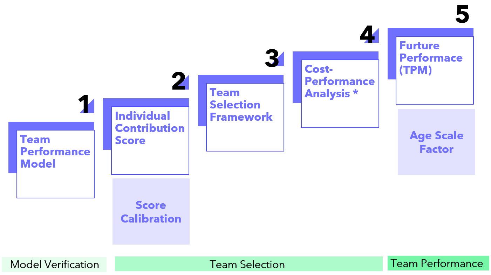
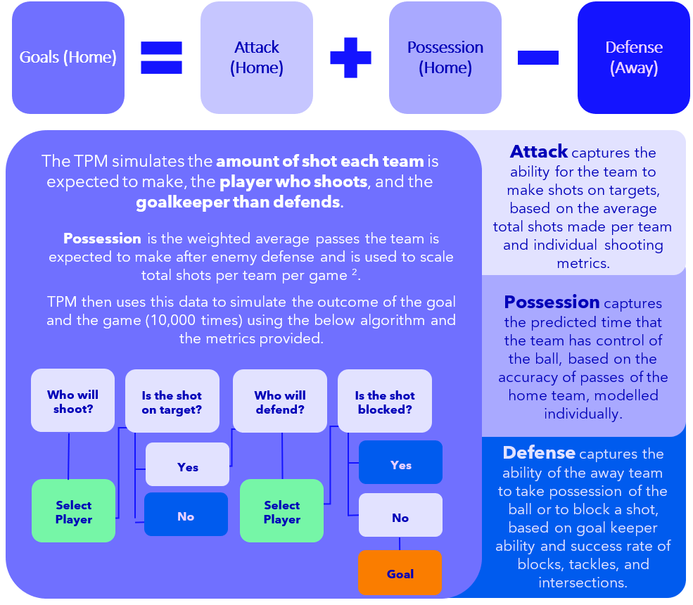
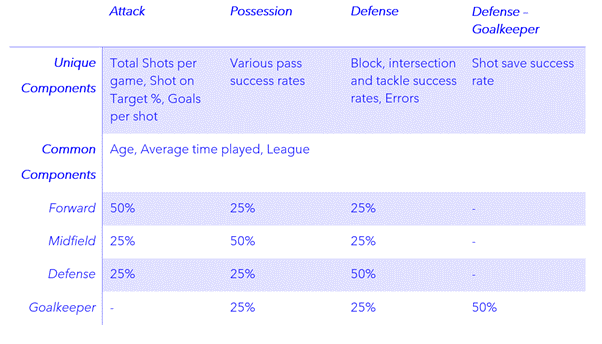

_ACTL 4001 - 2022 SOA Student Challenge_

# About DKA
Hi everyone! We are a team of two students who completed the SOA Student Challenge as part of the ACTL4001 course.

:boy: Ho On Tam

:girl: Fan (Angela) Bu

---

## Table of Contents
  * [Scope and Objectives](#scope-and-objectives)
  * [Model Design](#model-design)
  * [Team Selection](#team-selection)
  * [Economic Projection](#economic-projection)
  * [Implementation Plan](#implementation-plan)
  * [Risk and Risk Mitigation](#risk-and-risk-mitigation)
  * [Limitations](#limitations)
  * [Conclusion](#conclusion)
---

## Scope and Objectives
DKA aims to develop a comprehensive simulation model for the committee, with no defined parameters based on the dataset, to allow the committee to continuously monitor the performance of the RNT without adjusting the model. In addition to the model, we aim to provide a development plan that would promote soccer in Rarita and boost the economy in the surrounding region. 

To further assist the committee to monitor and review the team performance, we have provided several frameworks to minimize the human bias in decision making. We have also provided a review schedule and metrics that the committee should assess on a timely basis. 
DKA has recognizes the limited dataset that the committee has provided us and have highlighted the assumptions and relevant risk associated within this report. 

## Model Design
We defined a 5-step approach to identify the optimal team for Rarita.

### 1. Team Performance Model
We have has developed a simulation-based approach to predict the outcome of individual games. This model is used to validate the chosen Raritan National Team against the competitors. 

The advantage of this approach include:
•	Scalability of the model as there are no parameters defined.
•	Results can be monitored as the model is independent of yearly data. 
•	Minimize assumptions required due to limited data, as opposed to GLM, GBM approaches. 

It follows the below algorithm in simulating the outcome of the game. 

For the purpose of the assignment, a round robin approach was adopted for the group stage. This involves simulating 625 different sets of games, each 10,000 times! The R code is available [here](01_SOA_Model_v1.0.R), with an accompanying excel setup file [here](01_SOA_Model_Input_v0.1.xlsm). To run the code, download both files, save it in the same folder and run all the code in R. The output will be in a seperate excel sheet.

After the group stage, we ran a seperate single elimination bracket using the simulating probabilities from above. The resultant probability of reaching each stage for the chosen team is as below. 

## 2. Team Selection
To choose the optimal team, we aim to maximise the key parameters using in the team performance model. For each player, we collated their relevant score in shooting, passing and defending, and calculated a score based in each area. This was then scaled based on thier position as below. 

Using this score, we also projected the growth and decline rate of players at different ages and also the relative performance of players in different league. The projected growth and decline rate is applied to simulate future probablities of winning above.

To futher assist the committee to select a national team in the future, we have developed a comprehensive qualitative decision tree for Rarita. 

The final team selected is as below.

## Economic Projection

## Implementation Plan

## Risk and Risk Mitigation

## Limitations

## Conclusion
