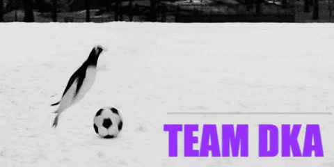
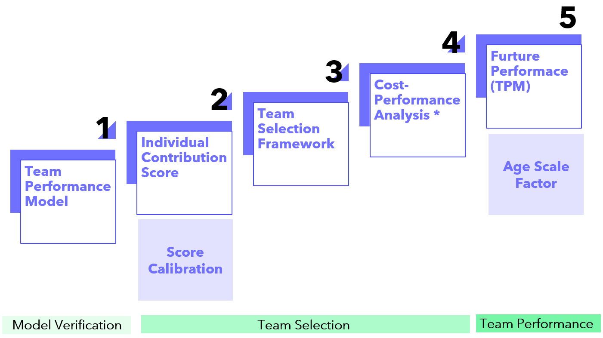
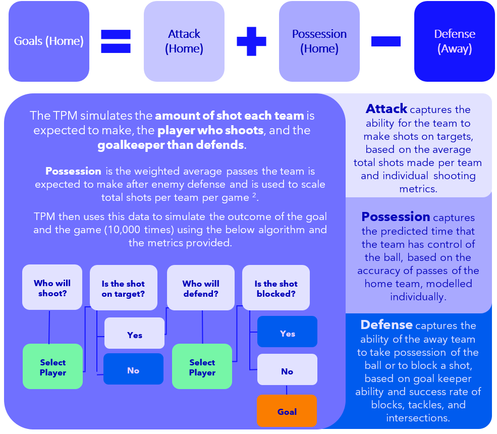
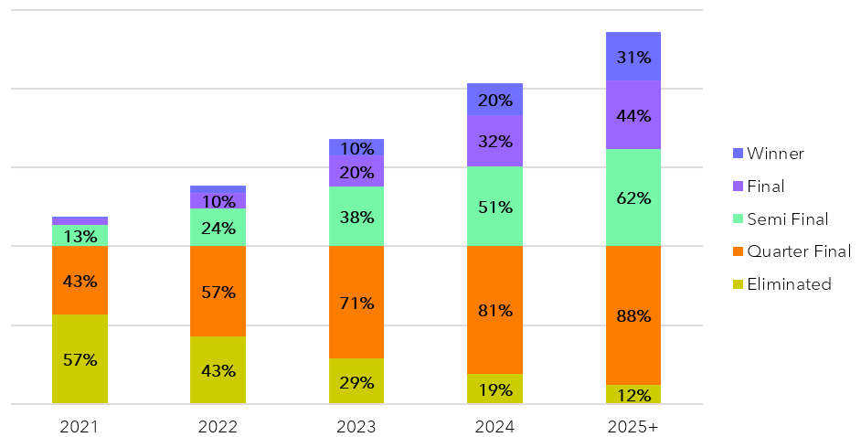
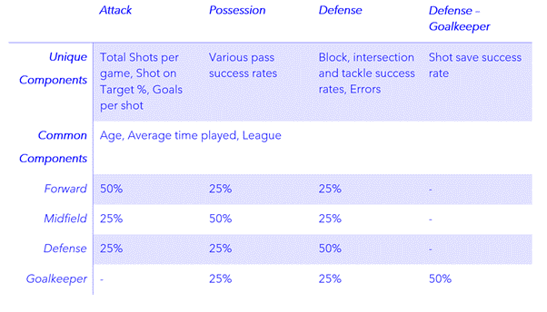
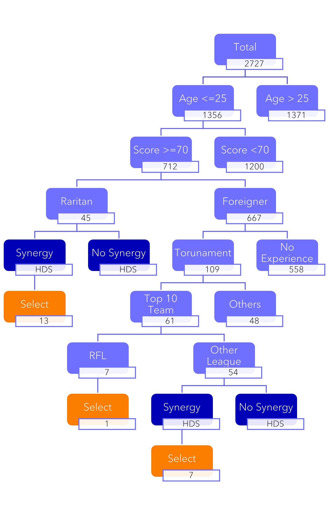
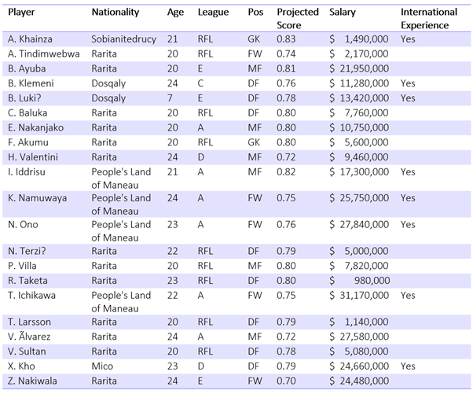

_ACTL 4001 - 2022 SOA Student Challenge_

# About DKA
Hi everyone! We are a team of two students who completed the SOA Student Challenge as part of the ACTL4001 course.

:boy: Ho On Tam

:girl: Fan (Angela) Bu

---

## Table of Contents
  * [Scope and Objectives](#scope-and-objectives)
  * [Model Design](#model-design)
  * [Team Selection](#team-selection)
  * [Economic Projection](#economic-projection)
  * [Implementation Plan](#implementation-plan)
  * [Risk and Risk Mitigation](#risk-and-risk-mitigation)
  * [Limitations](#limitations)
  * [Conclusion](#conclusion)
---

## Scope and Objectives
DKA aims to develop a comprehensive simulation model for the committee, with no defined parameters based on the dataset, to allow the committee to continuously monitor the performance of the RNT without adjusting the model. In addition to the model, we aim to provide a development plan that would promote soccer in Rarita and boost the economy in the surrounding region. 

To further assist the committee to monitor and review the team performance, we have provided several frameworks to minimize the human bias in decision making. We have also provided a review schedule and metrics that the committee should assess on a timely basis. 
DKA has recognizes the limited dataset that the committee has provided us and have highlighted the assumptions and relevant risk associated within this report. 

## Model Design
We defined a 5-step approach to identify the optimal team for Rarita.

### 1. Team Performance Model
We have has developed a simulation-based approach to predict the outcome of individual games. This model is used to validate the chosen Raritan National Team against the competitors. 

The advantage of this approach include:
•	Scalability of the model as there are no parameters defined.
•	Results can be monitored as the model is independent of yearly data. 
•	Minimize assumptions required due to limited data, as opposed to GLM, GBM approaches. 

It follows the below algorithm in simulating the outcome of the game. 

For the purpose of the assignment, a round robin approach was adopted for the group stage. This involves simulating 625 different sets of games, each 10,000 times! The R code is available [here](01_SOA_Model_v1.0.R), with an accompanying excel setup file [here](01_SOA_Model_Input_v0.1.xlsm). To run the code, download both files, save it in the same folder and run all the code in R. The output will be in a seperate excel sheet.

After the group stage, we ran a seperate single elimination bracket using the simulating probabilities from above. The resultant probability of reaching each stage for the chosen team is as below. 

## 2. Team Selection
To choose the optimal team, we aim to maximise the key parameters using in the team performance model. For each player, we collated their relevant score in shooting, passing and defending, and calculated a score based in each area. This was then scaled based on thier position as below. 

Using this score, we also projected the growth and decline rate of players at different ages and also the relative performance of players in different league. The projected growth and decline rate is applied to simulate future probablities of winning above.

To futher assist the committee to select a national team in the future, we have developed a comprehensive qualitative decision tree for Rarita. 

The final team selected is as below.

## 3. Economic Projection
### Performance-Led Economic Impact

**Economic Growth and GDP**
 
Historically, there has been a strong relationship between nation’s GDP and strong international performance. In the case of Rarita, we expect:
 
•	Increase consumption following each win in the elimination stage of approximately 20%, with a significant loss of approximately 40% if eliminated due to consumer sentiment, celebrations, and merchandise. 
 
•	Increase participation in sports (1-3%) inspired by strong RNT results leading to higher consumption in sports-related purchases.
 
These effects are generally short-lived and are credited from expected future consumption.
 
 
**Equity Market**
 
•	Depending on the performance of RNT in the elimination round, there will be increased short-term volatility within the equity market for the winner and runner-up.
 
•	Based on empirical data, the winning nation is expected to outperform the market by 3.5%, with the runner-up underperforming by 4%. 
 
The effects are generally reversed within one year.
 
 
**Tourism and International Reputation**
 
•	Rarita is expected to see a surge in international recognition and support following competitive results.
 
•	Larger awareness across social media platforms, with TikTok followers expected to triple, matching other nations with similar performance.
 
•	This will lead to more tourism across Rarita, especially after the development of new stadiums from 2026. 
 
 
### Project-Led Economic Impact
**Infrastructure**
 
The proposed stadiums are concentrated around East and West Rarita and expected to:
 
•	Increase employment in the construction sector of 3% in the local areas.
 
•	Distribute wealth between Central Rarita and East and West Rarita as more investments are made around the stadiums.
 
•	However, the jobs are likely to be temporary and the revenue generated from the revenue may not be fully realized by local community.
 
•	Furthermore, as more stadiums are constructed, the maintenance cost and renovation cost may cause the committee to be insolvent. 
 
•	DKA proposes a set of long-term infrastructure projects to facilitate job growth and recommend the committee to hire local vendors within the stadium.
 
 
**Hosting Tournaments**
 
After the proposed stadiums are built, Rarita will be eligible to host the tournament. Expected benefits (and costs) include:
 
•	Significant growth in tourism (short-term boost of > 1 million) with potential to attract more tourist in the long run with gained international exposure.
 
•	Increase connectivity within Rarita with added transportation to support the tournament.
 
•	Long term growth if the infrastructure built during the tournament is transferable for daily use of local citizen.
 
•	However, this might conflict with other infrastructure development in Rarita affecting economic growth. 
 
•	May lead to significant debt post-tournament, which may take years to repay. 17
 
 
_At this stage, we recommend the committee to host isolated, friendly tournaments. This will significantly reduce the cost of hosting and:_
 
•	The committee can target specific development regions and promote tourism and retailing by hosting frequent friendly competitions.
 
•	Introduce foreign investment into West Rarita, to reduce the inequality in wealth distribution. 

## Implementation Plan
We have developed a multi-step implementation plan summarised below. The four key deliverables are team selection, infrastructure developement, academy setup and strenghtening the RFL.

## Risk and Risk Mitigation

## Limitations

## Conclusion
