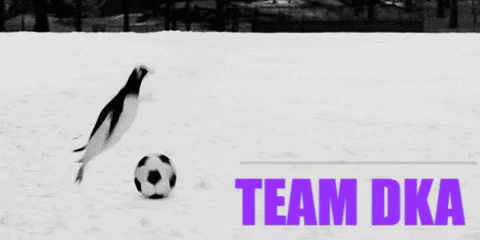

_ACTL 4001 - 2022 SOA Student Challenge_

# About DKA
Hi everyone! We are a team of two students who completed the SOA Student Challenge as part of the ACTL4001 course.

:boy: Ho On Tam

:girl: Fan (Angela) Bu

---

## Table of Contents

  * [Scope and Objectives](#scope-and-objectives)
  * [Model Design](#model-design)
  * [1. Team Performance Model](#1-team-performance-model)
  * [2. Team Selection](#2-team-selection)
  * [3. Economic Projection](#3-economic-projection)
    + [Performance-Led Economic Impact](#performance-led-economic-impact)
    + [Project-Led Economic Impact](#project-led-economic-impact)
  * [4. Implementation Plan](#4-implementation-plan)
    + [Team Selection](#team-selection)
    + [Infrastructure Developement](#infrastructure-developement)
    + [Net Cashflow](#net-cashflow)
    + [Reporting Metric](#reporting-metric)
  * [5. Risk and Risk Mitigation](#5-risk-and-risk-mitigation)
  * [6. Adeqaucy Analysis](#6-adeqaucy-analysis)
  * [7. Limitations](#7-limitations)
  * [Reference List](#reference-list)

---

## Scope and Objectives
DKA aims to develop a comprehensive simulation model for the committee, with no defined parameters based on the dataset, to allow the committee to continuously monitor the performance of the RNT without adjusting the model. In addition to the model, we aim to provide a development plan that would promote soccer in Rarita and boost the economy in the surrounding region. 

To further assist the committee to monitor and review the team performance, we have provided several frameworks to minimize the human bias in decision making. We have also provided a review schedule and metrics that the committee should assess on a timely basis. 
DKA has recognizes the limited dataset that the committee has provided us and have highlighted the assumptions and relevant risk associated within this report. 

## Model Design
We defined a 5-step approach to identify the optimal team for Rarita.

## 1. Team Performance Model
We have has developed a simulation-based approach to predict the outcome of individual games. This model is used to validate the chosen Raritan National Team against the competitors. 

The advantage of this approach include:
 
>•	Scalability of the model as there are no parameters defined.
> 
>•	Results can be monitored as the model is independent of yearly data. 
> 
>•	Minimize assumptions required due to limited data, as opposed to GLM, GBM approaches. 
 
 
It follows the below algorithm in simulating the outcome of the game. 

For the purpose of the assignment, a round robin approach was adopted for the group stage. This involves simulating 625 different sets of games, each 10,000 times! The R code is available [here](01_SOA_Model_v1.0.R), with an accompanying excel setup file [here](01_SOA_Model_Input_v0.1.xlsm). To run the code, download both files and the [data file](2022-student-research-case-study-player-data.xlsx), save it in the same folder and run all the code in R. The output will be in a seperate excel sheet.

After the group stage, we ran a seperate single elimination bracket using the simulating probabilities from above. The resultant probability of reaching each stage for the chosen team is as below. 

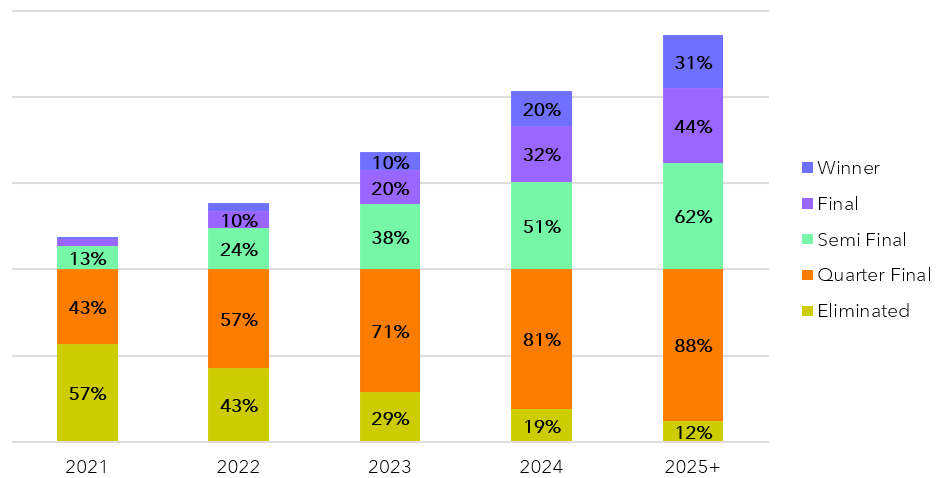

## 2. Team Selection
To choose the optimal team, we aim to maximise the key parameters using in the team performance model. For each player, we collated their relevant score in shooting, passing and defending, and calculated a score based in each area. This was then scaled based on thier position as below. 

Using this score, we also projected the growth and decline rate of players at different ages and also the relative performance of players in different league. The projected growth and decline rate is applied to simulate future probablities of winning above.

To futher assist the committee to select a national team in the future, we have developed a comprehensive qualitative decision tree for Rarita. 

The final team selected is as below.

## 3. Economic Projection
### Performance-Led Economic Impact

**Economic Growth and GDP**
 
Historically, there has been a strong relationship between nation’s GDP and strong international performance. In the case of Rarita, we expect:
 
>•	Increase consumption following each win in the elimination stage of approximately 20%, with a significant loss of approximately 40% if eliminated due to consumer sentiment, celebrations, and merchandise. 
> 
>•	Increase participation in sports (1-3%) inspired by strong RNT results leading to higher consumption in sports-related purchases.
> 
These effects are generally short-lived and are credited from expected future consumption.
 

**Equity Market**
 

>•	Depending on the performance of RNT in the elimination round, there will be increased short-term volatility within the equity market for the winner and runner-up.
> 
>•	Based on empirical data, the winning nation is expected to outperform the market by 3.5%, with the runner-up underperforming by 4%. 
 
The effects are generally reversed within one year.
 
 

**Tourism and International Reputation**
 

>•	Rarita is expected to see a surge in international recognition and support following competitive results.
> 
>•	Larger awareness across social media platforms, with TikTok followers expected to triple, matching other nations with similar performance.
> 
>•	This will lead to more tourism across Rarita, especially after the development of new stadiums from 2026. 
 

### Project-Led Economic Impact

**Infrastructure**
 

The proposed stadiums are concentrated around East and West Rarita and expected to:
 
>•	Increase employment in the construction sector of 3% in the local areas.
> 
>•	Distribute wealth between Central Rarita and East and West Rarita as more investments are made around the stadiums.
> 
>•	However, the jobs are likely to be temporary and the revenue generated from the revenue may not be fully realized by local community.
> 
>•	Furthermore, as more stadiums are constructed, the maintenance cost and renovation cost may cause the committee to be insolvent. 
> 
>•	DKA proposes a set of long-term infrastructure projects to facilitate job growth and recommend the committee to hire local vendors within the stadium.
 

**Hosting Tournaments**
 

After the proposed stadiums are built, Rarita will be eligible to host the tournament. Expected benefits (and costs) include:
 
>•	Significant growth in tourism (short-term boost of > 1 million) with potential to attract more tourist in the long run with gained international exposure.
> 
>•	Increase connectivity within Rarita with added transportation to support the tournament.
> 
>•	Long term growth if the infrastructure built during the tournament is transferable for daily use of local citizen.
> 
>•	However, this might conflict with other infrastructure development in Rarita affecting economic growth. 
> 
>•	May lead to significant debt post-tournament, which may take years to repay. 17
 

_At this stage, we recommend the committee to host isolated, friendly tournaments. This will significantly reduce the cost of hosting and:_
 
>•	The committee can target specific development regions and promote tourism and retailing by hosting frequent friendly competitions.
> 
>•	Introduce foreign investment into West Rarita, to reduce the inequality in wealth distribution. 

## 4. Implementation Plan
We have developed a multi-step implementation plan summarised below. The four key deliverables are team selection, infrastructure developement, academy setup and strenghtening the RFL. We have provided an overview for the first two deliverables, a more in-depth analysis of all projects is available  [here](04_ImplementationPlan.xlsx)

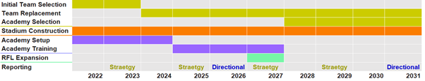

### Team Selection
The proposed team consists mainly of domestic Raritan players from a mixture of leagues, that are not in a national team. To supplement the lack of international exposure, several loaners are included in the initial team. 

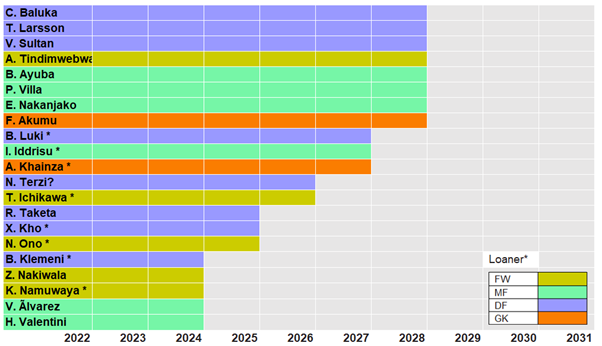

DKA advises the committee to introduce replacement players one year in advance, for retiring players reaching age 27 to allow the transfer of skills and game knowledge. The first replacement begins in 2024 for 5 players. 

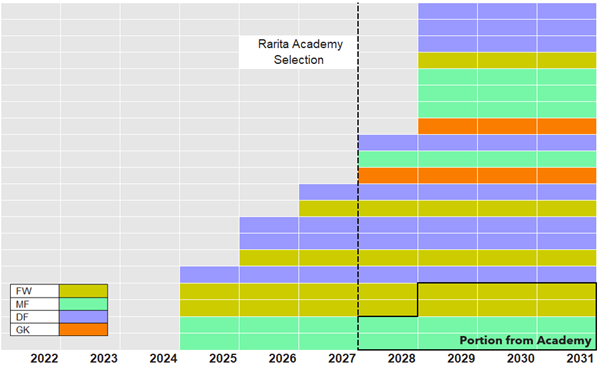

### Infrastructure Developement

To meet and boost the projected growing demand of soccer in Rarita, DKA recommends:
 
>•	Developing 8 stadiums with training facilities in the next 10 years
> 
>•	Establish connections and sponsorships with local companies and the RFL.
 
 
DKA has projected the revenue and expense (excluding initial investment cost) of the stadiums upon completion . We observe that stadiums could generate a strong revenue stream upon international success of RNT. The fund will be vital for future hosting endeavours and strengthening RFL and RNT. 

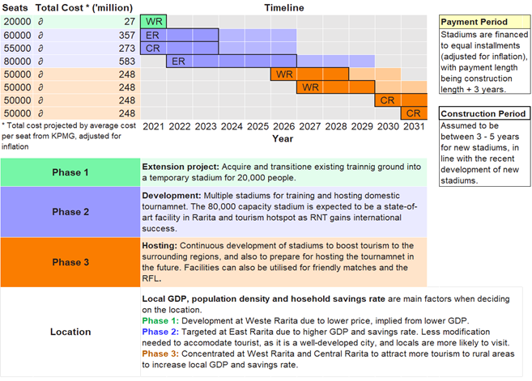

### Net Cashflow
A further breakdown of projected total revenue and expense (invlusive of salary) is provided below.

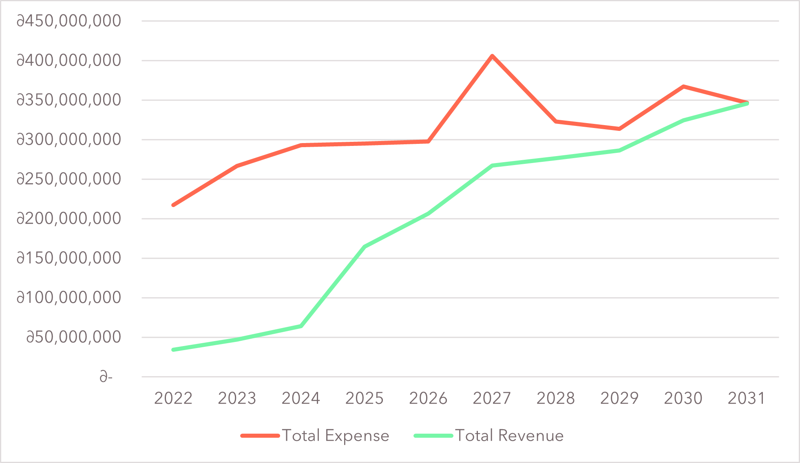

We note that the inital gap is due to large cash outflow to infrastructure developement and strategic recruitment. Rarita is expected to break even from 2032 and the expected solvency is analysed below. 

### Reporting Metric
We advise the committee to perform an annual review, biannual strategy review and a directional review every 5 years to ensure that the Raritan National Team remains competitive and that domestic talent is discovered.

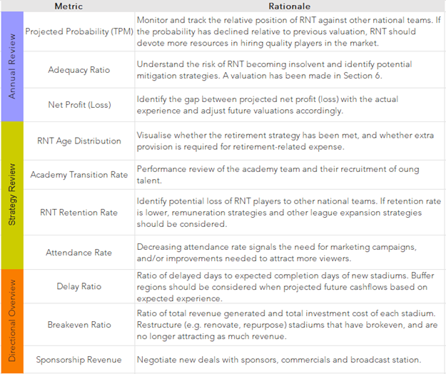

## 5. Risk and Risk Mitigation

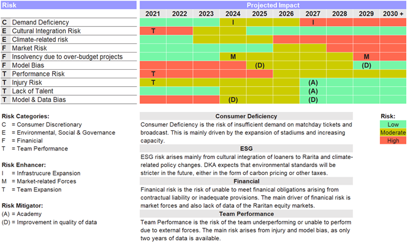

**Consumer Discretionary**

>•	Large disruptions may affect future attendance rates, e.g. further lockdowns from COVID-19
> 
>•	Economic recession may impact attendance as individuals have lower disposable income

**Mitigation:** Adopt a flexible pricing model, with admission price adjustments reviewed biannually (strategy review). Marketing strategies can be adopted in combination with sponsors to boost viewership both in person and at home.
 
 

**ESG**

>•	Cultural differences in loaner’s home country and Rarita (languages and values)
> 
>•	Climate related revenue reduction from physical risk and increase in expenses from policy changes (E.g. carbon pricing) 

**Mitigation:** Consider cultural fit in addition to performance when considering loaners. Strategy review should assess and include provisions required for climate-related items. Currently, no provisions are made as there is insufficient information on the regulations in Rarita.
 
 

**Financial**

>•	Exchange rate fluctuations may disincentivize tourist from attending Raritan tournaments.
> 
>•	Investment rates are implied from the market and not representative of Raritan equity markets
> 
>•	Insolvency due to market fluctuations and project delays

**Mitigation:** Currently, there is limited data on the market rates of the Raritan equity market, to mitigate the risk, the model should be updated annually and adjust for previous experience. The committee could consider discounts for tourist attending soccer events when exchange rates are high to smoothen the demand deficiency.
 
 

**Team Performance**

>•	The current probability projections rely heavily on two years of observed data, the model may be biased or inaccurate.
> 
>•	Performance and injury risk can significantly affect attendance, and we are unable to project it due to lack of data.

**Mitigation:** The accuracy of the model will increase with more observed data as the ICS and IAS projections become more accurate. The expected team performance should be evaluated on an annual basis. To accommodate for performance and injury risk, the team includes 9 substitutes. 
 
 

## 6. Adeqaucy Analysis
To further assess the solvency risk of the combined RNT project and whether additional funding is required, DKA conducted an adequacy analysis by:

>•	Simulating the probability of adequacy over 10,000 simulations, by setting inflation, investment, and wage growth as random variables
> 
>•	Comparing different scenarios: with or without injection of $100,000,000 at 2025, different proportion of asset invested (0%, 40%, 80%)
 
DKA recommends that a 70% probability of adequacy is maintained. 
 

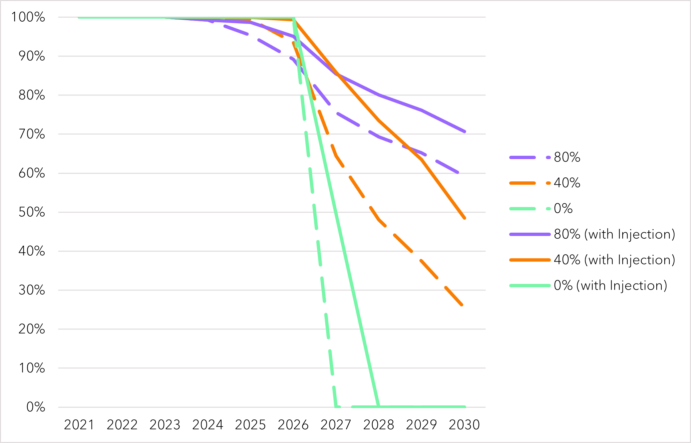

**Key Observations:**

>•	Without investment, insolvency is certain by 2028
> 
>•	Optimal allocation at 40% invested (with injection) as it is less subjected to investment fluctuations with significant benefit over not-investing. 

## 7. Limitations

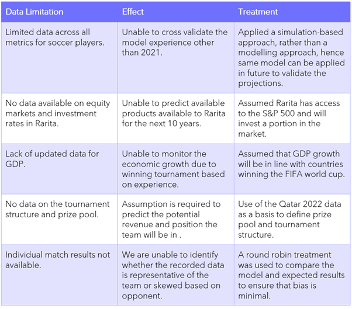

# Thank you!
Thank you for reading our project! This is a summary of the works in our final project, which containts more in-depth methodology and justification!

## Reference List

>Ahmadu, S., NFF's new Nike deal worth $3.75M (743m Naira). NFF's new Nike deal worth $3.75m (743m Naira) | Goal.com. Available at: https://www.goal.com/en-ng/news/4093/nigerian-football/2015/04/27/11191922/nffs-new-nike-deal-worth-375m-743m-naira [Accessed March 12, 2022]. 
> 
>Anon, 2016. Do big sporting events make us do more sport? BBC Future. Available at: https://www.bbc.com/future/article/20160805-do-big-sporting-events-make-us-do-more-sport [Accessed March 14, 2022]. 
> 
>Anon, 2016. Nike extends kit sponsorship of France national football team in record deal. FashionNetwork.com. Available at: https://ww.fashionnetwork.com/news/Nike-extends-kit-sponsorship-of-france-national-football-team-in-record-deal,762524.html [Accessed March 3, 2022]. 
> 
>Anon, How to become a football scout & how much do they earn? How to become a football scout & how much do they earn? | Goal.com. Available at: https://www.goal.com/en-ph/news/how-to-become-football-scout-how-much-they-earn/1at7qoa2mdeec18jk96trdsshy [Accessed March 26, 2022]. 
> 
>Dendir, S., 2016. Sports analytics : A guide for coaches, managers, and other decision makers. Available at: https://searchworks.stanford.edu/articles/nlebk__607491 >[Accessed February 26, 2022]. 
> 
>Farah, L. & Hesam, Z., 2021. Racial abuse of england players exposes deep societal fractures and the need for change. World Economic Forum. Available at: https://www.weforum.org/agenda/2021/07/racial-abuse-of-england-players-exposes-deep-societal-fractures-and-the-need-for-change/ [Accessed March 10, 2022]. 
> 
>Goldman Sachs, 2014. The World Cup and Economics 2014 - goldman sachs. The World Cup and Economics 2014. Available at: https://www.goldmansachs.com/insights/archive/world-cup-and-economics-2014-folder/world-cup-economics-report.pdf [Accessed March 10, 2022]. 
> 
>Graeme, B., 2020. How long does it take to build a football stadium? CoventryLive. Available at: https://www.coventrytelegraph.net/sport/football/football-news/how-long-take-build-football-18634036 [Accessed March 10, 2022]. 
> 
>Jones, R., 2022. Adidas suspends kit deal with Russian FA . SportsPro. Available at: https://www.sportspromedia.com/news/adidas-russia-football-kit-sponsorship-deal-suspended/#:~:text=with%20immediate%20effect.-,',US%2414.4%20million)%20per%20year. [Accessed March 24, 2022]. 
> 
>Juan, B., 2020. Hosting the FIFA World Cup: An economic ... - digital showcase. University of Lynchburg. Available at: https://digitalshowcase.lynchburg.edu/cgi/viewcontent.cgi?article=1159&context=utcp [Accessed March 12, 2022]. 
> 
>Kelly, R., 2018. World Cup 2018 prize money: How much do the winners get & countries' bonus payments. World Cup 2018 prize money: How much do the winners get & countries' bonus payments | Goal.com. Available at: https://www.goal.com/en-us/news/world-cup-2018-prize-money-how-much-do-the-winners-get-countries-/h9rstxkx3z6k1c8eonct5g1xa [Accessed March 15, 2022]. 
> 
>Matheson, V., 2014. Were the billions Brazil spent on World Cup stadiums worth it? FiveThirtyEight. Available at: https://fivethirtyeight.com/features/were-the-billions-brazil-spent-on-world-cup-stadiums-worth-it/ [Accessed March 21, 2022]. 
> 
>Olenski, S., 2014. The impact of the World Cup on online shopping and consumer spending. Forbes. Available at: https://www.forbes.com/sites/steveolenski/2014/07/17/the-impact-of-the-world-cup-on-online-shopping-and-consumer-spending/?sh=5237a8835ef1 [Accessed March 10, 2022]. 
> 
>Person, R., 2022. Adidas trumps rival Puma to supply Italian soccer kit from 2023. Reuters. Available at: https://www.reuters.com/lifestyle/sports/adidas-ousts-puma-kit-italy-soccer-team-2023-2022-03-09/ [Accessed March 13, 2022]. 
> 
>Published by M. Szmigiera & 12, M., 2021. Average real wage growth globally 2006-2019. Statista. Available at: https://es.statista.com/statistics/1234219/average-real-wage-growth-globally/ [Accessed March 10, 2022]. 
> 
>Riach, J., 2015. West Ham's Olympic Stadium running costs 'to be funded by taxpayer'. The Guardian. Available at: https://www.theguardian.com/football/2015/aug/06/bbc-claims-west-ham-olympic-stadium [Accessed March 25, 2022]. 
> 
>Ward, A., 2018. 9 questions about the 2018 World Cup you were too embarrassed to ask. Vox. Available at: https://www.vox.com/2018/6/12/17356780/world-cup-2018-russia-teams-schedule-tickets [Accessed March 20, 2022]. 

